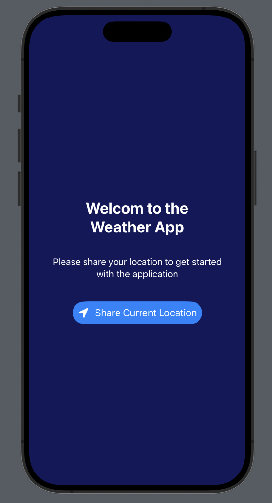
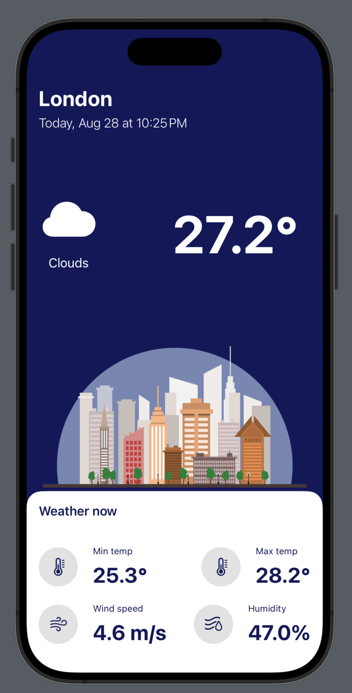

# WeatherApplication

<p align="left">
  
</p>

<p align="right">
  
</p>

## Overview

The `WeatherApplication` is a SwiftUI-based iOS application designed to display current weather information based on user-provided latitude and longitude. It integrates with the OpenWeatherMap API to fetch and display weather data in a user-friendly interface.

## Technologies Used

- **SwiftUI**: For building the user interface in a declarative manner.
- **Combine**: For handling asynchronous operations (used indirectly via Swift's async/await features).
- **OpenWeatherMap API**: Provides weather data including temperature, weather conditions, wind speed, and humidity.

## Features

- Fetch current weather data using latitude and longitude.
- Display weather information including temperature, weather conditions, wind speed, and humidity.
- Save and load weather data to and from local storage.
- Responsive and modern user interface built with SwiftUI.

## Setup

### Prerequisites

- Xcode 14 or later
- Swift 5.8 or later

### Installation

1. **Clone the Repository:**

   ```sh
   git clone https://github.com/jeevanghimire/WeatherApplication.git
   cd WeatherApplication
``` swift
guard let url = URL(string: "https://api.openweathermap.org/data/2.5/weather?lat=\(latitude)&lon=\(longitude)&appid=YOUR_API_KEY&units=metric") else {
    fatalError("Missing URL")
}
```
